<p align="center">
  
</p>

<h1 align="center">
  
</h1>

<p align="center">
  
</p>

<h2 align="center">🩷 About Me</h2>

<table>
<tr>
<td width="57%" valign="top">

```yaml
name:      Pitchakorn (CHAMP)
role:      Embedded / AIoT Developer
studying:  B.Eng. Computer Engineering, RMUTT
focus:     ESP32 · OpenThread · MQTT · Modbus RTU · Computer Vision · RAG
learning:  [Rust for embedded, Edge AI]
motto:     "If it blinks, it works. If it publishes, it ships."
```

</td>
<td width="43%" align="center" valign="top">
  
</td>
</tr>
</table>

<h2 align="center">📡 Present Status</h2>

| ช่วง | กำลังทำอะไรอยู่ |
|---|---|
| **ส.ค. 2026** | ทำระบบ RAG ภาษาไทยสำหรับตอบคำถามปัญหามือถือ/คอมพิวเตอร์ พร้อมหน้าเว็บให้ทดลองถามจริง |
| **ส.ค. 2026** | งานทีม — data pipeline ทำความสะอาดข้อความไทย แล้วทำ embedding ด้วยโมเดลที่รันในเครื่อง |
| **ก.ค. 2026** | ต่อ ESP32-C5 เข้า Thread แล้วส่ง MQTT ออกอินเทอร์เน็ตผ่าน NAT64 ได้ครบเส้นทาง |
| **กำลังเรียน** | Rust สำหรับงาน embedded · Edge AI |

<h2 align="center">🧰 Languages &amp; Tools I've Placed My Hands On</h2>

<p align="center">
  
  <br/>
  
</p>

<h2 align="center">🛠️ Tech Stack</h2>

> รวมของที่ **เคยลงมือทำจริง** ทั้งจากงานฝึกงาน โปรเจกต์เรียน และงานส่วนตัว — บางตัวยังไม่มี repo สาธารณะ

**Languages**


**Boards & Embedded Platforms**


**Sensors & Peripherals**


**Networking & Protocols**


**Robotics & Vision**


**Backend, Data & Ops**


**Generative AI & LLM**


**Build & Tools**


<h2 align="center">📊 GitHub Stats</h2>

<p align="center">
  
</p>

<p align="center">
  
  
</p>

<p align="center">
  
</p>

<h2 align="center">🚀 Featured Projects</h2>

| Project | What it does | Stack |
|---|---|---|
| [**esp32c5-thread**](https://github.com/pitchakorn-pkt/esp32c5-thread) | ESP32-C5 Thread device อ่าน SHT40 ส่งขึ้น MQTT ผ่าน NAT64 + web provisioning | `ESP-IDF` `OpenThread` `MQTT` |
| [**led-colorwatch**](https://github.com/pitchakorn-pkt/led-colorwatch) | ตรวจจับสี LED เสียผ่านกล้อง + หน้าเว็บ รันได้ทั้ง Win/macOS/Linux | `Python` `OpenCV` |
| [**esp32-modbus-rs485**](https://github.com/pitchakorn-pkt/esp32-modbus-rs485) | ตัวอย่าง Modbus RTU master/slave บน ESP32 ผ่าน RS485 | `C++` `Arduino` |

<p align="center">
  
</p>
